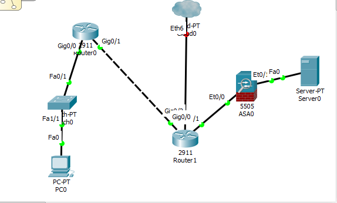
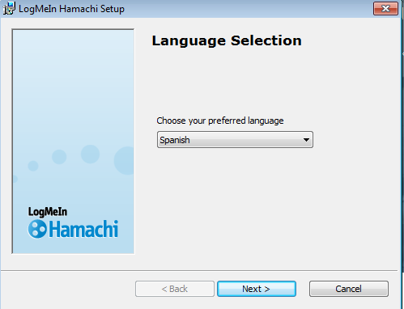
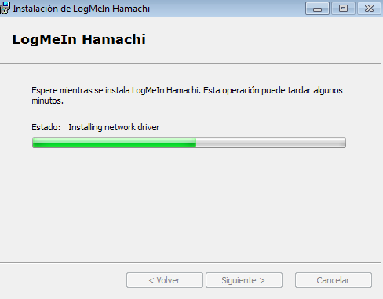
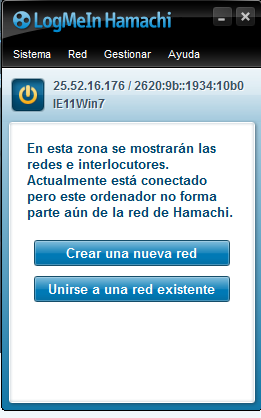
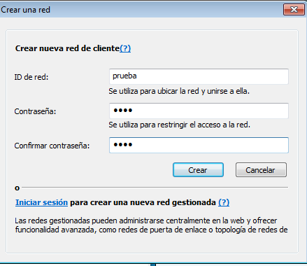
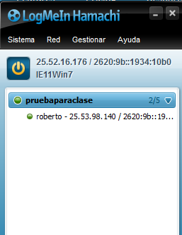

## 1- Diseña una red (realiza esquema) en la que se distingan los siguientes elementos (define brevemente cada uno de ellos):


- `Router Frontera:`

Dispositivo que proporciona conectividad a nivel de red o nivel tres en el modelo OSI. Su función
principal consiste en enviar o encaminar paquetes de datos de una red a otra. El Router de frontera
es el que conecta la red interna con la Nube y es el último punto del perímetro de red.

- `Perímetro de red:`

Es la división tanto física como lógica entre lo que está dentro de la red y aquello que está fuera.

- `DMZ`:

Zona insegura que se ubica entre la red interna de una organización y una red externa, generalmente
en Internet. El objetivo de una DMZ es que las conexiones desde la red interna y la externa a la
DMZ estén permitidas, mientras que en general las conexiones desde la DMZ solo se permitan a la
red externa -- los equipos (hosts) en la DMZ no pueden conectar con la red interna.

- `Lan`:

LAN son las siglas de Local Area Network, Red de área local. Una LAN es una red que conecta los
ordenadores en un área relativamente pequeña y predeterminada (como una habitación, un edificio,
o un conjunto de edificios).

`Firewall`:

Un cortafuegos (firewall) es una parte de un sistema o una red que está diseñada para bloquear el
acceso no autorizado, permitiendo al mismo tiempo comunicaciones autorizadas


## 2. Esquema de los elementos definidos anteriormente correctamente en funcionamiento en Cisco Packet Tracer




## 3- Utiliza Hamachi para demostrar el concepto de acceso remoto. Detalla y deja constancia de los pasos necesarios para la realización de este punto.


En primer lugar,hay que descargar Hamachi. Lo podemos descargar desde la web oficial.
https://www.vpn.net/


- Iniciamos la instalación.



Solo tenemos que seguir el asistente de instalación.



Ya lo tenemos instalado. Tenemos que registrarnos en la página y ya podemos conectarnos a hamachi.



- Solo nos queda crear una red.



- Ya tenemos creado la red.

### Instalación Hamachi Debian

Instalamos el hamachi en el Debian.

```console

kiro@vergil:~/Descargas$ ls -l | grep hamachi
-rw-r--r-- 1 kiro kiro   1359976 ene 24 14:51 logmein-hamachi_2.1.0.174-1_amd64.deb
kiro@vergil:~/Descargas$ sudo dpkg -i logmein-hamachi_2.1.0.174-1_amd64.deb
[sudo] password for kiro:
Seleccionando el paquete logmein-hamachi previamente no seleccionado.
(Leyendo la base de datos ... 307939 ficheros o directorios instalados actualmente.)
Preparando para desempaquetar logmein-hamachi_2.1.0.174-1_amd64.deb ...
Desempaquetando logmein-hamachi (2.1.0.174-1) ...
Configurando logmein-hamachi (2.1.0.174-1) ...
mknod: /dev/net/tun: El fichero ya existe
Starting LogMeIn Hamachi VPN tunneling engine logmein-hamachi
starting - success
Procesando disparadores para systemd (232-25+deb9u1) ...
kiro@vergil:~/Descargas$
```
Ya lo tenemos instalado.

- Solo tenemos que abrir una terminal y escribir los siguiente.

Vamos a conectarnos al a red de Windows 7 desde Debian.

```console
kiro@vergil:~/Descargas$ sudo hamachi join pruebaparaclase
Password:
Joining pruebaparaclase .. ok
kiro@vergil:~/Descargas$ hamachi list
You do not have permission to control the hamachid daemon.
You can run 'hamachi' as root, or you can add your login name to the file
'/var/lib/logmein-hamachi/h2-engine-override.cfg'
and restart the daemon with
sudo /etc/init.d/logmein-hamachi restart
Example:
Ipc.User      <login name>
kiro@vergil:~/Descargas$ sudo hamachi list
 * [pruebaparaclase]  capacity: 2/5, subscription type: Free, owner: IE11Win7 (220-762-969)
     * 220-762-969   IE11Win7                   25.52.16.176      alias: not set           2620:9b::1934:10b0                          direct      UDP  192.168.1.104:33509
kiro@vergil:~/Descargas$
```
- Vamos al sistema operativo Windows 7 y comprobamos que son dos usuarios conectados.




## 4. Realiza una conexión con SSH y describe detalladamente el proceso que has seguido, incluyendo capturas de pantalla.


## 5. Describe como utilizar SSHFS en un equipo con Linux Ubuntu para montar un directorio remoto en el sistema local.


### 5.1 Instalamos shfs con apt-get install shfs

Ahora que hemos instalado sshfs tenemos que utilizarlo atendiendo a su uso, similar a ssh en el
hecho de que vamos a tener que autenticarnos mediante el usuario y contraseña, motivo por el
cual está de más decir que dicho usuario debe ser una cuenta válida en el equipo remoto (en nuestro
ejempo será el equipo con IP 192.168.1.100).

- `sshfs roberto@equiporemoto:/ruta/hacia/directorio`

Entonces lo que necesitamos es crear el directorio local que va a apuntar hacia el directorio remoto
(que en nuestro ejemplo puede ser /home/programas), lo cual hacemos de la siguiente manera:

- `mkdir /mnt/server`

Después montamos el directorio remoto en este directorio, haciendo:

- `sshfs root@192.168.1.100:/home/programas / /mnt/server`

Se nos pedirá la clave de root en el equipo remoto, que debemos conocer así que la ingresamos y
luego de esto ya habremos montado el servidor remoto en nuestro equipo local. Algo que podemos
comprobar fácilmente si ejecutamos:

```console
$df -h
O:
ls -l /mnt/server
```

Una vez que comencemos a utilizar esto seguramente sabremos apreciar la gran comodidad que nos
ofrece, y si ese es el caso puede que deseemos que este proceso sea realizado en forma automática
cuando iniciamos nuestro equipo. Y podemos conseguirlo, para lo cual tenemos que editar el
archivo /etc/fstab:


- `nano /etc/fstab`

Añadimos la siguiente entrada:

```console
sshfs#$root@192.168.1.100:/ /mnt/server fuse
defaults,idmap=user,allow_other,reconnect,_netdev,users 0 0

```
Con esto ya tendremos lo deseado, pero podemos ir más lejos y si nuestro equipo tiene al
controvertido systemd como sistema de inicio podemos utilizar el montaje ‘por demanda’, es decir
que será realizado en forma automática cuando lo necesitemos (por ejemplo, cuando intentemos
acceder al directorio local que está enlazada con el directorio remoto).

```console
roberto@equiporemoto:/home/programas/ /mnt/server fuse.sshfs noauto,x-
systemd.automount,_netdev,users,idmap=user,allow_other,reconnect 0 0

```
