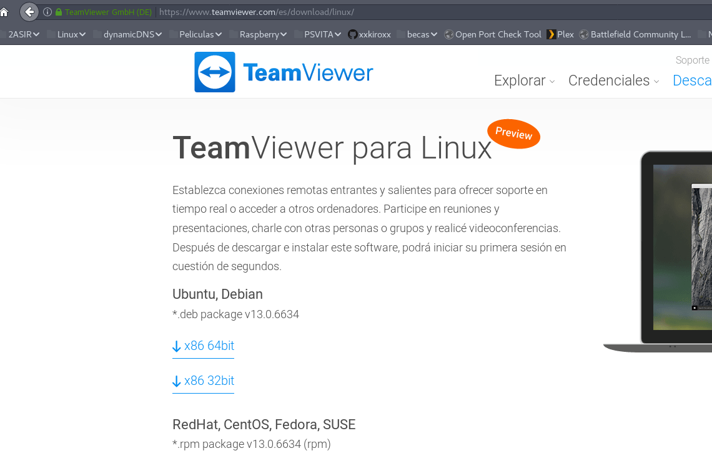
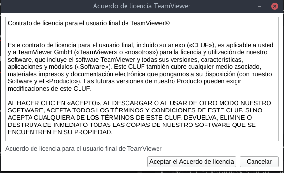
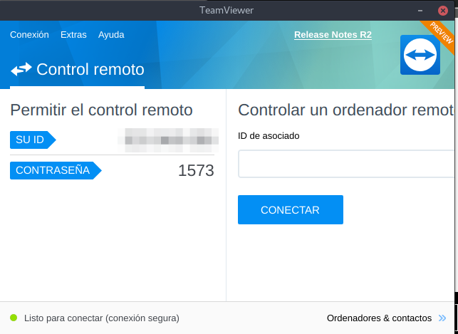
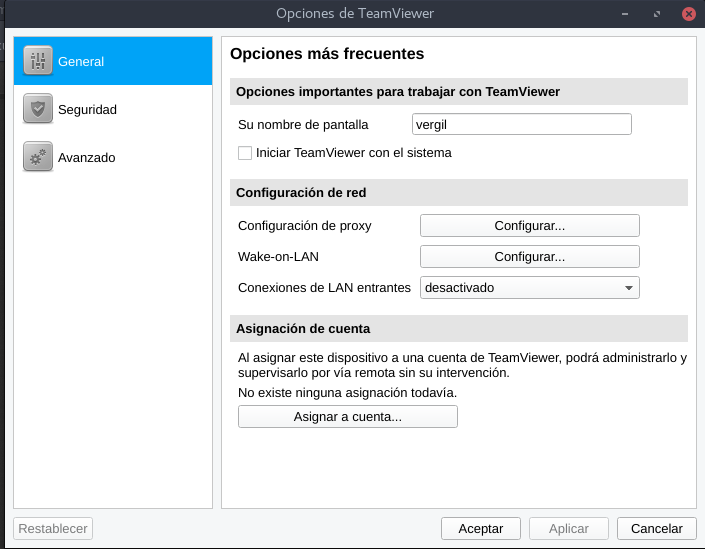
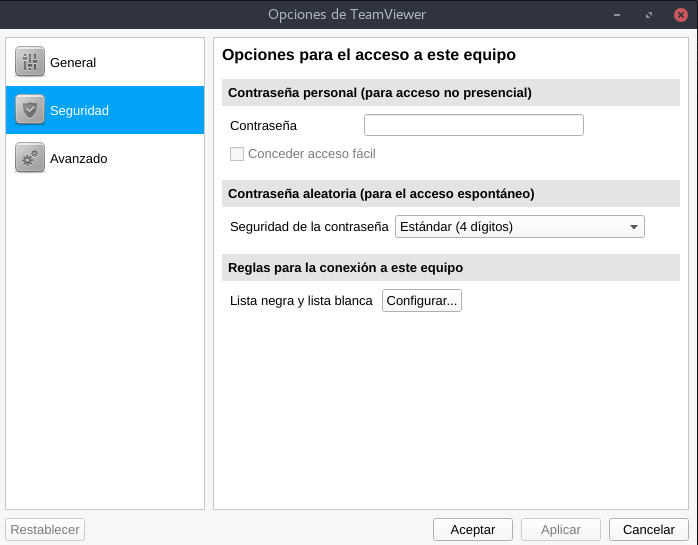
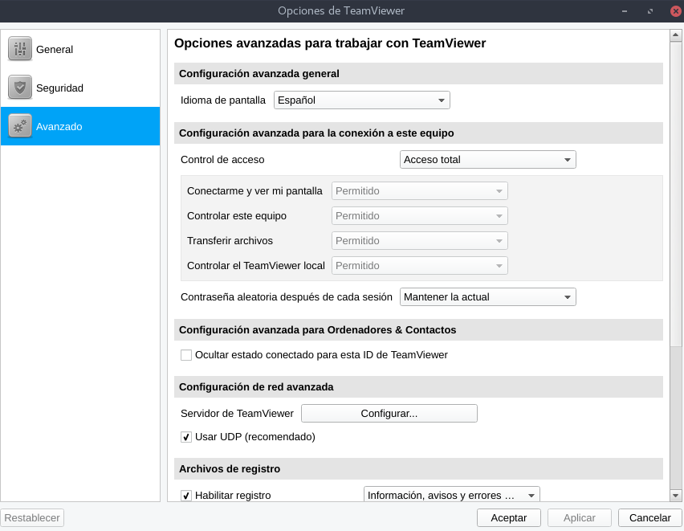
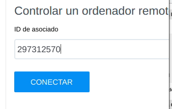
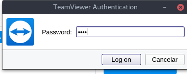
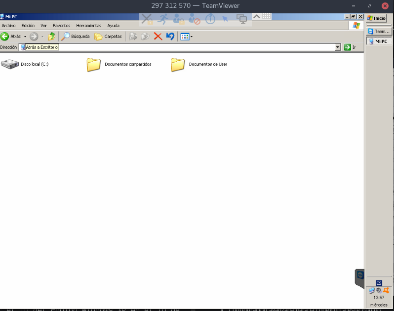

# TeamViewer en Debian


- `Roberto Hernández Sanabria`

## Descargamos el TeamViewer

Vamos a la página oficial de TeamViewer y descargamos la versión para Debian.

- [Descargar](https://www.teamviewer.com/es/download/linux/)

Existen versiones para diferentes sistemas operativos.



Seleccionamos la versión que nosotros necesitamos en nuestro Equipo.

En mi caso será una de `64bit`

## Instalación de TeamViewer

Abrimos una terminal y vamos a la carpeta donde descargamos el `TeamViewer`.

```console
kiro@vergil:~/Descargas$ ls -l | grep teamviewer
-rw-r--r-- 1 kiro kiro  10374958 ene 20 13:07 teamviewer_13.0.6634_amd64.deb
kiro@vergil:~/Descargas$
```

Para instalarlos debemos realizar el siguiente comando.

```console
kiro@vergil:~/Descargas$ sudo dpkg -i teamviewer_13.0.6634_amd64.deb
Seleccionando el paquete teamviewer previamente no seleccionado.
(Leyendo la base de datos ... 307830 ficheros o directorios instalados actualmente.)
Preparando para desempaquetar teamviewer_13.0.6634_amd64.deb ...
Desempaquetando teamviewer (13.0.6634) ...
Configurando teamviewer (13.0.6634) ...
Procesando disparadores para gnome-menus (3.13.3-9) ...
Procesando disparadores para desktop-file-utils (0.23-1) ...
Procesando disparadores para mime-support (3.60) ...
Procesando disparadores para hicolor-icon-theme (0.15-1) ...
kiro@vergil:~/Descargas$
```

- En caso de que tengamos problemas de dependecias a la hora de instalar el `TeamViewer`.

```console
kiro@vergil:~/Descargas$ sudo apt install -f
Leyendo lista de paquetes... Hecho
Creando árbol de dependencias       
Leyendo la información de estado... Hecho
0 actualizados, 0 nuevos se instalarán, 0 para eliminar y 0 no actualizados.
kiro@vergil:~/Descargas$
```
- Ya tenemos instalado el TeamViewer, solo tenemos que escribir en la terminar `teamviewer`.

La primera vez nos sale que debemos aceptar los términos.



Al aceptar ya podemos ver el programa.

- Nos fijamos en el ID, es nuestro identificador y de bajo tenemos nuestra contraseña. El ID nunca cambia.



- En la parte de ID de asociado es el identificador del Equipo que nosotros queremos conectarnos.

## Configuraciones avanzadas de TeamViewer

Solo tenemos que ir a las opciones avanzadas



- En está ventana podemos configurar el nombre, si queremos que inicie TeamViewer cada vez que enciendes el ordenador, configurar el proxy y el `Wake On Lan` esto sirve para cuando el ordenador está apagado enviar por internet un paquete para encender dicho ordenador por red.



- Podemos crear reglas y también establecer un contraseña para iniciar sesión.



- Configuración avanzada para la conexión a este Equipo.

## Conexión a un Equipo de Windows XP

Solo tenemos que escribir el ID del Equipo Windows XP en el ID de Asociados.



- Nos pide la contraseña



- Ya establecemos conexión con el TeamViewer de Windows XP.


