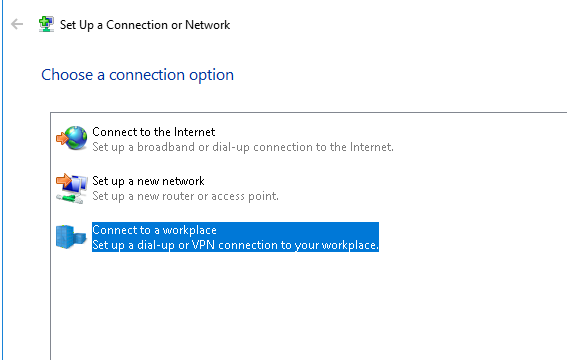

# Windows Server 2012 - VPN

- [1. Configuración de la Máquina Virtual](#1)
- [2. Instalación del Windows Server 2012](#2)
- [3. Configuración de las tarjetas de red](#3)
    - [3.1 Configuración tarjeta de red Externa](#4)
    - [3.2 Configuración Tarjeta de Red Interna](#5)
- [4. Instalación del rol de Remote Access.](#6)
- [5. Configuración de Enrutamiento y accesso remoto para VPN](#7)
- [6. Configuración Equipo Cliente para VPN](#8)

**Roberto Hernández Sanabria**

## 1. Configuración de la Máquina Virtual

Tenemos que agregar una nueva máquina virtual en `VirtualBox`.
Es importante que agregamos dos tarjeta de red.

- Una Tarjeta de Red será `Interna`
- Una Tarjeta de Red será `Externa`

## 2. Instalación del Windows Server 2012.

Solo tenemos que agregar en la máquina virtual la `iso del Windows Server 2012`.

- Seguimos los pasos del asistente de `Windows`.
- Instalación se realizará todo por `defecto`

- Seleccionamos el idioma, en nuestro caso el `Español`

- Seleccionamos la versión con entorno gráfico `GUI`.

- No vamos a realizar ninguna partición al disco duro, lo dejaremos por defecto.

- Esperamos que termine la instalación.

En un momento de la instalación nos pedirá la contraseña para el administrador del sistemas operativo `Windows Server 2012`

Ya tenemos instalado el `Windows Server 2012`

## 3. Configuración de las tarjetas de red

Solo tenemos que ir `cambiar la Configuración de la red`.

- Le cambiamos el nombre a las tarjetas de red para no confundirnos.

### 3.1 Configuración tarjeta de red Externa

Vamos a la tarjeta de red `Externa` y le damos a `propiedades`.

- Tenemos que desactivar todas las casillas menos la de `TCP/IP Versión 4`

Configuramos la dirección IP como los tenemos en la imagen y luego tenemos que ir `opciones avanzadas`

Vamos a la pestaña de `WINS` y configuramos como tenemos en la imagen.

### 3.2 Configuración Tarjeta de Red Interna

Solo tenemos que establecer una IP en la tarjeta de red `Interna`

## 4. Instalación del rol de Remote Access.

Solo tenemos que ir `administrador del sistema -> Agregar nuevo rol`.

- Seleccionamos `acceso remoto`

- Le damos a siguiente.

- Seleccionamos la característica `DirectAccess y VPN(RAS)`

- Le damos siguiente.

- Lo dejamos por defecto y siguiente.

- Le damos instalar.

- Seleccionamos `abrir el asisten para introducción`

- Seleccionamos Implementar solo `VPN`

## 5. Configuración de Enrutamiento y accesso remoto para VPN

Tenemos que darle al botón secundario del ratón y le damos a `configurar y habilitar enrutamiento y acceso remoto`

- Le damos siguiente.

- Seleccionamos la que viene por defecto.

- Marcamos solo `VPN`

- Configuramos la tarjeta de red `Externa` y habilitar seguridad en la interfaz.

- Seleccionamos de un intervalo de direcciones especificado.

- Le damos a nuevo y configuramos el intervalo de de direcciones para `IPv4`

- Configuramos el intervalo.

- Ya lo tenemos configurado y le damos siguiente.

- No, usar enrutamiento y acceso remoto para autenticar las solicitudes de conexiones.

- Le damos a finalizar.

- Aceptar el relevo de mensajes DHCP.

Ya tenemos configurado lo de VPN.

- Seleccionamos `IPv4` y vemos la configuración en la tarjeta de red `Externa`

- Seleccionamos y le damos propiedades.

- Vamos a filtros entrantes y vemos los paquetes.

## 6. Configuración Equipo Cliente para VPN

Vamos a la configuración de red del equipo cliente y establecemos la siguiente dirección IP.

- Vamos a la configuración para establecer la `VPN`

- Seleccionamos el de `VPN`

- Usar mi conexión con `VPN`

- Seleccionamos la de configurar internet mas tarde.

- Escribimos la IP de nuestra `VPN`

- Vemos que ya podemos darle a conectar.

- Comprobamos que tenemos agregado la nueva configuración de VPN en la red.

- Le damos con el botón secundario del ratón a propiedades a `VPN` y le indicamos lo siguiente que esta en la foto, en la pestaña de `Seguridad`

- Al darle conectar nos muestra un mensaje. No podemos acceder a la VPN.

- Vamos al servidor y creamos un usuario nuevo llamado `prueba` y le damos a propiedades y le damos a la pestaña `marcado` y le damos a permitir accesso.

- Le damos a conectar desde el equipo cliente a la VPN y ya podemos tener conexión.

- Foto de comprobación que está conectado.

- Realizamos el siguiente comando `ipconfig` para ver si establece conexión a la VPN y nos da la ip de intervalo configurado.

